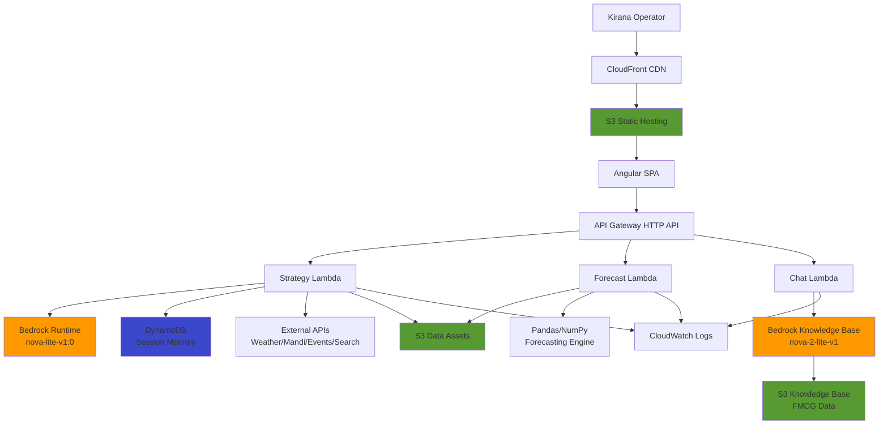

# Design Document: Meridian Commerce Engine

## Overview

The Meridian Commerce Engine is a serverless, cloud-native decision-support platform designed for Indian Kirana (neighborhood retail) operators. The system synthesizes real-time hyperlocal signals—weather conditions, mandi (wholesale market) pricing, local events, and search trends—with historical FMCG (Fast-Moving Consumer Goods) sales and inventory data to generate actionable recommendations for stocking, pricing, and replenishment decisions.

### Core Value Proposition

Traditional retail inventory management relies on historical patterns and manual intuition. Meridian augments this with:
- Real-time contextual awareness (weather impacts beverage demand, festivals drive specific SKU spikes)
- AI-powered reasoning that explains its recommendations
- Conversational access to domain knowledge
- Predictive forecasting to prevent stockouts and overstock

### System Boundaries

**In Scope:**
- Three primary user interfaces (Strategy Home, Predictive Forecasts, Virtual Category Manager)
- Integration with external hyperlocal data sources
- AI-powered insight generation using Amazon Bedrock
- Time-series demand forecasting
- RAG-based conversational assistant for FMCG domain queries
- Session-based memory for iterative strategy refinement

**Out of Scope:**
- Point-of-sale integration
- Inventory management system integration
- Payment processing
- Multi-tenant user authentication (single-operator focus)
- Real-time inventory tracking
- Supplier order automation

### Key Design Principles

1. **Serverless-First**: Zero infrastructure management, pay-per-use, automatic scaling
2. **Explainability**: All AI recommendations include reasoning traces
3. **Graceful Degradation**: System remains functional even when external APIs are unavailable
4. **Domain-Aware**: Deeply integrated with Indian retail semantics (pack types, festival calendars, mandi pricing)
5. **Separation of Concerns**: Clear boundaries between frontend delivery, API orchestration, compute, AI, and persistence layers

---

## Architecture

### High-Level Architecture



### Component Layers

#### 1. Frontend Delivery Layer
- **CloudFront Distribution**: Global CDN with HTTPS termination, caching static assets
- **S3 Bucket**: Origin for Angular SPA build artifacts (index.html, JS bundles, CSS, assets)
- **Angular SPA**: Client-side routing, reactive UI, HTTP client for API communication

#### 2. API Orchestration Layer
- **API Gateway (HTTP API)**: RESTful endpoint exposure with CORS configuration
- **Routes**:
  - `POST /strategy` → Strategy Lambda
  - `POST /forecast` → Forecast Lambda
  - `POST /chat` → Chat Lambda
- **Security**: CORS headers for allowed origins (local dev + production domain)

#### 3. Compute Layer
- **Strategy Lambda**: Orchestrates multi-tool agentic workflow using Bedrock converse API with tool-use loop
- **Forecast Lambda**: Executes time-series forecasting algorithm on historical FMCG data
- **Chat Lambda**: Proxies RAG queries to Bedrock Knowledge Base with domain-specific prompting

#### 4. AI/LLM Layer
- **Bedrock Runtime (Strategy)**: Tool-calling agent with access to weather, mandi, events, search, and memory tools
- **Bedrock Knowledge Base (Chat)**: Retrieval-augmented generation over FMCG dataset with semantic search

#### 5. Persistence Layer
- **DynamoDB Table**: Session-scoped strategy insights with timestamp-based ordering
- **S3 Data Bucket**: Static datasets (FMCG_2022_2024.csv, festivals.csv)
- **S3 Knowledge Base Bucket**: Processed FMCG data for Bedrock KB ingestion

#### 6. External Integration Layer
- **Data.gov.in Mandi API**: Real-time wholesale commodity pricing
- **Tomorrow.io Weather API**: Hyperlocal weather forecasts
- **PredictHQ Events API**: Local event calendar (festivals, sports, concerts)
- **Serper Search API**: Search intent signals for demand prediction

---


## Components and Interfaces

### Frontend Components

#### 1. Strategy Home Component
**Responsibility**: Display live reasoning feed and insight cards from strategy generation

**Interface**:
```typescript
interface StrategyRequest {
  date?: string; // YYYY-MM-DD, defaults to today
  location?: string;
  category?: string;
}

interface StrategyResponse {
  execution_steps: ExecutionStep[];
  insights: InsightCard[];
  timestamp: string;
}

interface ExecutionStep {
  step_number: number;
  tool_name: string;
  status: 'executing' | 'completed' | 'failed';
  duration_ms?: number;
}

interface InsightCard {
  category: string;
  insight: string;
  action: string;
  rationale: string;
}
```

**Key Behaviors**:
- User-triggered insight generation (button click, no auto-load)
- Progressive rendering of execution steps with timing animation
- Card-based layout for insights with category color coding
- Error state handling with retry capability

#### 2. Predictive Forecasts Component
**Responsibility**: Display 15-day demand projections with risk indicators

**Interface**:
```typescript
interface ForecastRequest {
  start_date?: string; // YYYY-MM-DD
  categories?: string[];
  skus?: string[];
}

interface ForecastResponse {
  forecast_period: {
    start_date: string;
    end_date: string;
  };
  projections: ForecastProjection[];
  risk_summary: RiskSummary;
}

interface ForecastProjection {
  sku_id: string;
  sku_name: string;
  category: string;
  daily_demand: DailyDemand[];
  baseline_comparison: number; // % vs 2023
  risk_level: 'low' | 'medium' | 'high';
}

interface DailyDemand {
  date: string;
  projected_units: number;
  confidence_interval: [number, number];
}

interface RiskSummary {
  high_risk_skus: number;
  projected_stockouts: number;
  overstock_warnings: number;
}
```

**Key Behaviors**:
- Line chart visualization with confidence intervals
- Risk-based SKU filtering and sorting
- Comparison view against historical baseline
- Export capability for forecast data

#### 3. Virtual Category Manager Component
**Responsibility**: Conversational RAG interface for FMCG domain queries

**Interface**:
```typescript
interface ChatRequest {
  query: string;
  session_id?: string;
}

interface ChatResponse {
  answer: string;
  sources: Source[];
  session_id: string;
}

interface Source {
  content: string;
  metadata: {
    sku?: string;
    category?: string;
    date_range?: string;
  };
}
```

**Key Behaviors**:
- Suggested prompts for common queries
- Markdown rendering for formatted responses
- Source citation display
- Session continuity for follow-up questions


### Backend Components

#### 1. Strategy Lambda Handler

**Responsibility**: Orchestrate multi-tool agentic workflow for hyperlocal strategy generation

**Tool Definitions**:
```python
tools = [
    {
        "name": "get_weather_forecast",
        "description": "Get weather forecast for location",
        "input_schema": {
            "location": "string",
            "days": "integer"
        }
    },
    {
        "name": "get_mandi_prices",
        "description": "Get current mandi wholesale prices",
        "input_schema": {
            "commodity": "string",
            "market": "string"
        }
    },
    {
        "name": "get_local_events",
        "description": "Get upcoming local events",
        "input_schema": {
            "location": "string",
            "date_range": "string"
        }
    },
    {
        "name": "search_trends",
        "description": "Get search intent signals",
        "input_schema": {
            "query": "string",
            "location": "string"
        }
    },
    {
        "name": "get_festival_calendar",
        "description": "Get festival dates from festivals.csv",
        "input_schema": {
            "start_date": "string",
            "end_date": "string"
        }
    },
    {
        "name": "get_recent_insights",
        "description": "Retrieve recent strategy insights from memory",
        "input_schema": {
            "limit": "integer"
        }
    },
    {
        "name": "store_insight",
        "description": "Store generated insight to memory",
        "input_schema": {
            "insight": "object"
        }
    }
]
```

**Execution Flow**:
1. Parse request payload (date, location, category filters)
2. Initialize Bedrock converse session with system prompt
3. Enter tool-use loop:
   - Send message to Bedrock with tool definitions
   - Capture tool invocation requests
   - Execute tool functions (external API calls, data lookups)
   - Return tool results to Bedrock
   - Collect execution steps for UI replay
4. Extract final insight cards from model response
5. Store insights to DynamoDB
6. Return structured response with execution trace

**Error Handling**:
- External API failures: Return cached/default values, log warning
- Bedrock throttling: Exponential backoff with max 3 retries
- Tool execution timeout: Skip tool, continue with available data
- Parsing errors: Return error payload with actionable message


#### 2. Forecast Lambda Handler

**Responsibility**: Generate 15-day demand projections using time-series forecasting

**Algorithm Approach**:
- Temporal Fusion Transformer (TFT) pattern or production-grade baseline (e.g., Prophet, ARIMA)
- Features: historical sales, seasonality, festival indicators, day-of-week
- Training window: 2022-2024 FMCG data
- Baseline comparison: Same period in 2023

**Execution Flow**:
1. Load FMCG_2022_2024.csv from S3 or local cache
2. Handle schema variance (sku_id vs sku column naming)
3. Filter data by request parameters (categories, SKUs)
4. Prepare time-series features (lag features, rolling averages, festival flags)
5. Run forecasting model for 15-day horizon
6. Calculate confidence intervals
7. Compare projections against 2023 baseline
8. Identify high-risk SKUs (projected demand > current stock-to-sales ratio)
9. Return structured forecast response

**Error Handling**:
- Missing data: Interpolate or use category-level aggregates
- Schema mismatch: Attempt column name normalization
- Insufficient history: Return error with minimum data requirements
- Model failure: Fall back to naive seasonal baseline

#### 3. Chat Lambda Handler

**Responsibility**: Proxy RAG queries to Bedrock Knowledge Base with domain-specific prompting

**System Prompt**:
```
You are a Virtual Category Manager for Indian Kirana retail stores. You have deep knowledge of FMCG products, including pack types (Single vs Carton), promotion flags, seasonal patterns, and inventory management best practices.

When answering questions:
- Be concise and actionable
- Reference specific SKUs, categories, or data points when relevant
- Consider pack_type and promotion_flag in your recommendations
- Provide retail-specific guidance (e.g., "Stock 2 cartons of X for festival season")
- If data is insufficient, acknowledge limitations clearly

Answer the user's question based on the retrieved context.
```

**Execution Flow**:
1. Parse chat request (query, session_id)
2. Call Bedrock Knowledge Base retrieve_and_generate API
3. Pass system prompt and user query
4. Extract answer and source citations
5. Format response with markdown support
6. Return structured chat response

**Error Handling**:
- Knowledge Base unavailable: Return error with fallback suggestion
- No relevant sources: Acknowledge and suggest query refinement
- Session timeout: Create new session, inform user


### Data Components

#### 1. DynamoDB Session Memory

**Table Schema**:
```python
{
    "TableName": "meridian-strategy-memory",
    "KeySchema": [
        {"AttributeName": "session_id", "KeyType": "HASH"},
        {"AttributeName": "timestamp", "KeyType": "RANGE"}
    ],
    "AttributeDefinitions": [
        {"AttributeName": "session_id", "AttributeType": "S"},
        {"AttributeName": "timestamp", "AttributeType": "N"}
    ],
    "BillingMode": "PAY_PER_REQUEST"
}
```

**Item Structure**:
```python
{
    "session_id": "uuid",
    "timestamp": 1234567890,
    "insight_type": "strategy",
    "category": "Beverages",
    "insight": "...",
    "action": "...",
    "rationale": "...",
    "metadata": {
        "date": "2024-01-15",
        "location": "Mumbai",
        "tools_used": ["weather", "events"]
    }
}
```

**Access Patterns**:
- Query recent insights by session_id, ordered by timestamp DESC
- Scan for insights by category (GSI if needed for performance)
- TTL attribute for automatic cleanup after 30 days

#### 2. S3 Data Assets

**Bucket Structure**:
```
meridian-data-assets/
├── datasets/
│   ├── FMCG_2022_2024.csv
│   └── festivals.csv
├── knowledge-base/
│   ├── fmcg-processed/
│   │   └── fmcg-chunks.json
│   └── metadata/
└── frontend/
    └── (Angular build artifacts)
```

**FMCG_2022_2024.csv Schema**:
```
sku_id (or sku), sku_name, category, date, units_sold, revenue, 
pack_type, promotion_flag, region, store_id
```

**festivals.csv Schema**:
```
festival_name, date, region, category_impact, demand_multiplier
```

---


## Data Models

### Domain Models

#### 1. Insight Card
```python
@dataclass
class InsightCard:
    category: str  # e.g., "Beverages", "Snacks", "Personal Care"
    insight: str  # Main observation
    action: str  # Recommended action
    rationale: str  # Explanation with data points
    confidence: float  # 0.0-1.0
    sources: List[str]  # Tool names used
    timestamp: datetime
```

#### 2. Forecast Projection
```python
@dataclass
class ForecastProjection:
    sku_id: str
    sku_name: str
    category: str
    daily_demand: List[DailyDemand]
    baseline_comparison: float  # % change vs 2023
    risk_level: RiskLevel
    recommended_stock: int  # Units to maintain
    
@dataclass
class DailyDemand:
    date: date
    projected_units: float
    confidence_lower: float
    confidence_upper: float
    
class RiskLevel(Enum):
    LOW = "low"
    MEDIUM = "medium"
    HIGH = "high"
```

#### 3. External Signal Models
```python
@dataclass
class WeatherForecast:
    location: str
    date: date
    temperature_max: float
    temperature_min: float
    precipitation_probability: float
    condition: str  # "sunny", "rainy", "cloudy"
    
@dataclass
class MandiPrice:
    commodity: str
    market: str
    price_per_quintal: float
    date: date
    change_percent: float
    
@dataclass
class LocalEvent:
    name: str
    date: date
    location: str
    category: str  # "festival", "sports", "concert"
    expected_attendance: int
    
@dataclass
class SearchTrend:
    query: str
    location: str
    trend_score: float  # 0-100
    related_categories: List[str]
```

#### 4. Session Memory Model
```python
@dataclass
class StrategySession:
    session_id: str
    created_at: datetime
    last_updated: datetime
    insights: List[InsightCard]
    context: Dict[str, Any]  # Location, date range, preferences
```


### Data Flow Models

#### Strategy Generation Flow
```
User Request → API Gateway → Strategy Lambda
    ↓
Initialize Bedrock Session
    ↓
Tool Loop:
    → Call External APIs (Weather, Mandi, Events, Search)
    → Query Festivals CSV
    → Retrieve Recent Insights from DynamoDB
    → Return Tool Results to Bedrock
    ↓
Generate Insight Cards
    ↓
Store to DynamoDB
    ↓
Return Response with Execution Trace
```

#### Forecast Generation Flow
```
User Request → API Gateway → Forecast Lambda
    ↓
Load FMCG_2022_2024.csv from S3
    ↓
Normalize Schema (sku_id vs sku)
    ↓
Filter by Categories/SKUs
    ↓
Feature Engineering:
    → Lag features (7, 14, 30 days)
    → Rolling averages
    → Festival indicators from festivals.csv
    → Day-of-week encoding
    ↓
Run Forecasting Model (15-day horizon)
    ↓
Calculate Confidence Intervals
    ↓
Compare vs 2023 Baseline
    ↓
Identify High-Risk SKUs
    ↓
Return Structured Forecast
```

#### Chat RAG Flow
```
User Query → API Gateway → Chat Lambda
    ↓
Call Bedrock Knowledge Base retrieve_and_generate
    ↓
Knowledge Base:
    → Semantic search over FMCG data chunks
    → Retrieve top-k relevant passages
    → Pass to nova-2-lite-v1 with system prompt
    ↓
Generate Answer with Citations
    ↓
Format Response (Markdown support)
    ↓
Return to User
```

### Data Validation Rules

1. **Date Formats**: All dates must be ISO 8601 (YYYY-MM-DD)
2. **SKU Identifiers**: Handle both `sku_id` and `sku` column names
3. **Category Names**: Normalize to title case, trim whitespace
4. **Numeric Ranges**:
   - Confidence scores: 0.0-1.0
   - Demand projections: >= 0
   - Prices: > 0
5. **Required Fields**:
   - InsightCard: category, insight, action
   - ForecastProjection: sku_id, daily_demand
   - ChatRequest: query

---


## Correctness Properties

*A property is a characteristic or behavior that should hold true across all valid executions of a system—essentially, a formal statement about what the system should do. Properties serve as the bridge between human-readable specifications and machine-verifiable correctness guarantees.*

### Property 1: Error Response Contract Preservation

*For any* API endpoint (strategy, forecast, chat) and any error condition (external API failure, invalid input, timeout), the error response shall conform to a structured error schema with actionable error messages and appropriate HTTP status codes.

**Validates: Requirements 2.16, 5.3**

### Property 2: Strategy Execution Trace Completeness

*For any* strategy generation request, the response shall include an ordered list of execution steps where each step contains a step_number, tool_name, and status field, and step numbers are sequential starting from 1.

**Validates: Requirements 3.1, 3.2**

### Property 3: Insight Card Field Completeness

*For any* strategy generation request that successfully completes, all returned insight cards shall contain non-empty values for category, insight, action, and rationale fields.

**Validates: Requirements 3.3**

### Property 4: Date Parameter Default Behavior

*For any* strategy or forecast request where the date parameter is omitted, the system shall use the current date (today) as the default value, and when a date is explicitly provided, the system shall use that exact date.

**Validates: Requirements 3.5**

### Property 5: Forecast Horizon Completeness

*For any* forecast request, the returned projections shall contain exactly 15 daily demand entries, with consecutive dates starting from the request start_date.

**Validates: Requirements 3.6**

### Property 6: Baseline Comparison Presence

*For any* forecast projection, the response shall include a baseline_comparison field containing a numeric percentage value representing the change versus the 2023 historical baseline for the same period.

**Validates: Requirements 3.7**

### Property 7: Risk Level Calculation

*For any* forecast projection, the system shall assign a risk_level value (low, medium, or high) based on the comparison between projected demand and historical stock-to-sales ratios, and shall identify SKUs with high risk in the risk_summary.

**Validates: Requirements 3.8**

### Property 8: Schema Variance Tolerance

*For any* FMCG dataset using either "sku_id" or "sku" as the SKU identifier column name, the forecast and chat systems shall successfully process the data without errors and produce valid outputs.

**Validates: Requirements 3.9**

### Property 9: Session Memory Timestamp Ordering

*For any* sequence of insights stored to DynamoDB with the same session_id, retrieving recent insights shall return them in descending timestamp order (most recent first).

**Validates: Requirements 4.4**

### Property 10: Response Schema Conformance

*For any* API response (strategy, forecast, chat) that completes successfully, the JSON payload shall conform to its defined TypeScript interface schema and shall be parseable without errors.

**Validates: Requirements 5.2, 7.2**

### Property 11: Date Format Consistency

*For any* API response containing date fields (timestamp, date, start_date, end_date), all date values shall conform to ISO 8601 format (YYYY-MM-DD for dates, YYYY-MM-DDTHH:mm:ssZ for timestamps).

**Validates: Requirements 5.4**

### Property 12: External API Graceful Degradation

*For any* strategy generation request where one or more external APIs (weather, mandi, events, search) fail or timeout, the system shall continue execution with available data sources and return a valid response with insights based on the successfully retrieved signals, rather than failing completely.

**Validates: Requirements 7.3**

---


## Error Handling

### Error Categories

#### 1. External API Failures
**Scenarios**:
- Weather API timeout or rate limit
- Mandi API unavailable
- Events API authentication failure
- Search API quota exceeded

**Handling Strategy**:
- Implement exponential backoff with max 3 retries
- Use circuit breaker pattern to prevent cascading failures
- Fall back to cached data if available (with staleness indicator)
- Continue strategy generation with available signals
- Log warning with API name and error details
- Include degraded_signals field in response indicating which APIs failed

**Example Error Response**:
```json
{
  "execution_steps": [...],
  "insights": [...],
  "warnings": [
    {
      "type": "external_api_failure",
      "api": "weather",
      "message": "Weather API timeout, using cached data from 2 hours ago"
    }
  ],
  "degraded_signals": ["weather"]
}
```

#### 2. Data Processing Errors
**Scenarios**:
- FMCG CSV schema mismatch
- Missing required columns
- Invalid date formats in source data
- Null values in critical fields

**Handling Strategy**:
- Attempt schema normalization (sku_id → sku)
- Interpolate missing values using category averages
- Skip invalid rows and log count
- Return error if >20% of data is invalid
- Provide actionable error message with data quality issues

**Example Error Response**:
```json
{
  "error": "data_quality_error",
  "message": "FMCG dataset has 35% invalid rows (missing sku_id and date)",
  "details": {
    "total_rows": 10000,
    "invalid_rows": 3500,
    "missing_columns": ["sku_id"],
    "suggestion": "Verify FMCG_2022_2024.csv schema matches expected format"
  },
  "status_code": 422
}
```


#### 3. AI/LLM Errors
**Scenarios**:
- Bedrock throttling (TooManyRequestsException)
- Model timeout
- Invalid tool call format
- Knowledge Base unavailable

**Handling Strategy**:
- Exponential backoff for throttling (1s, 2s, 4s)
- Timeout after 55 seconds (Lambda has 60s limit)
- Validate tool call schema before execution
- Return partial results if some tool calls succeeded
- Provide fallback response for chat if KB unavailable

**Example Error Response**:
```json
{
  "error": "bedrock_throttled",
  "message": "AI service temporarily unavailable, please retry in 30 seconds",
  "retry_after": 30,
  "status_code": 429
}
```

#### 4. Input Validation Errors
**Scenarios**:
- Invalid date format
- Unknown category name
- Missing required fields
- Invalid session_id

**Handling Strategy**:
- Validate all inputs before processing
- Return 400 Bad Request with specific field errors
- Provide examples of valid input formats
- Suggest corrections for common mistakes

**Example Error Response**:
```json
{
  "error": "validation_error",
  "message": "Invalid request parameters",
  "field_errors": [
    {
      "field": "date",
      "value": "2024-1-5",
      "error": "Date must be in YYYY-MM-DD format",
      "example": "2024-01-05"
    }
  ],
  "status_code": 400
}
```

#### 5. Resource Errors
**Scenarios**:
- DynamoDB throttling
- S3 access denied
- Lambda memory exceeded
- Lambda timeout

**Handling Strategy**:
- Use DynamoDB auto-scaling and on-demand billing
- Implement exponential backoff for DynamoDB writes
- Monitor Lambda memory usage and adjust if needed
- Stream large datasets instead of loading into memory
- Return 503 Service Unavailable for resource exhaustion

**Example Error Response**:
```json
{
  "error": "resource_unavailable",
  "message": "Service temporarily overloaded, please retry",
  "retry_after": 60,
  "status_code": 503
}
```


### Error Response Schema

All error responses shall conform to this structure:

```typescript
interface ErrorResponse {
  error: string;  // Error type identifier
  message: string;  // Human-readable error message
  details?: Record<string, any>;  // Additional context
  field_errors?: FieldError[];  // Validation errors
  retry_after?: number;  // Seconds to wait before retry
  status_code: number;  // HTTP status code
  request_id?: string;  // For support/debugging
  timestamp: string;  // ISO 8601 timestamp
}

interface FieldError {
  field: string;
  value: any;
  error: string;
  example?: string;
}
```

### Logging Strategy

**CloudWatch Log Structure**:
```json
{
  "timestamp": "2024-01-15T10:30:00Z",
  "level": "ERROR",
  "request_id": "abc-123",
  "handler": "strategy_lambda",
  "error_type": "external_api_failure",
  "error_message": "Weather API timeout",
  "context": {
    "api": "tomorrow.io",
    "location": "Mumbai",
    "timeout_ms": 5000
  },
  "stack_trace": "..."
}
```

**Log Levels**:
- ERROR: Failures that prevent request completion
- WARN: Degraded functionality (external API failures, cached data usage)
- INFO: Successful requests with execution metrics
- DEBUG: Detailed tool execution traces (disabled in production)

### Monitoring and Alerts

**CloudWatch Metrics**:
- Error rate by endpoint (threshold: >5% over 5 minutes)
- External API failure rate (threshold: >20% over 10 minutes)
- Lambda duration (threshold: >50s)
- DynamoDB throttled requests (threshold: >10 over 5 minutes)

**Alert Actions**:
- SNS notification to operations team
- Automatic circuit breaker activation for failing external APIs
- Scale-up trigger for Lambda concurrency if needed

---


## Testing Strategy

### Dual Testing Approach

The Meridian Commerce Engine requires both unit testing and property-based testing for comprehensive coverage:

- **Unit tests**: Verify specific examples, edge cases, error conditions, and integration points
- **Property tests**: Verify universal properties across randomized inputs to catch edge cases that unit tests might miss

Both approaches are complementary and necessary. Unit tests provide concrete examples and catch specific bugs, while property tests verify general correctness across a wide input space.

### Testing Framework Selection

**Backend (Python)**:
- **Unit Testing**: `pytest` with `pytest-asyncio` for async handlers
- **Property-Based Testing**: `hypothesis` library
- **Mocking**: `pytest-mock` and `moto` for AWS service mocking
- **Coverage**: `pytest-cov` with minimum 80% coverage target

**Frontend (Angular)**:
- **Unit Testing**: Jasmine + Karma (Angular defaults)
- **Component Testing**: Angular Testing Library
- **E2E Testing**: Playwright for critical user flows
- **Property-Based Testing**: `fast-check` library for TypeScript

### Property-Based Testing Configuration

Each property test shall:
- Run minimum **100 iterations** per test (due to randomization)
- Include a comment tag referencing the design document property
- Use appropriate generators for domain-specific data types
- Include shrinking to find minimal failing examples

**Tag Format**:
```python
# Feature: meridian-commerce-engine, Property 1: Error Response Contract Preservation
@given(...)
def test_error_response_contract(...)
```


### Backend Testing Strategy

#### 1. Strategy Lambda Tests

**Unit Tests**:
```python
# Test specific tool executions
def test_weather_tool_returns_forecast():
    """Verify weather tool returns expected structure"""
    
def test_mandi_tool_handles_missing_commodity():
    """Verify graceful handling of unknown commodity"""
    
def test_festival_calendar_filters_by_date_range():
    """Verify festival lookup returns only dates in range"""
    
def test_insight_storage_to_dynamodb():
    """Verify insights are stored with correct schema"""
    
def test_execution_steps_are_sequential():
    """Verify step numbers increment correctly"""
```

**Property Tests**:
```python
# Feature: meridian-commerce-engine, Property 2: Strategy Execution Trace Completeness
@given(st.dates(), st.text(min_size=1), st.lists(st.sampled_from(['weather', 'mandi', 'events'])))
def test_strategy_response_has_ordered_steps(date, location, tools):
    """For any valid strategy request, response includes ordered execution steps"""
    response = strategy_handler({'date': date, 'location': location})
    assert 'execution_steps' in response
    steps = response['execution_steps']
    assert len(steps) > 0
    for i, step in enumerate(steps):
        assert step['step_number'] == i + 1
        assert 'tool_name' in step
        assert 'status' in step

# Feature: meridian-commerce-engine, Property 3: Insight Card Field Completeness
@given(st.dates(), st.text(min_size=1))
def test_insight_cards_have_required_fields(date, location):
    """For any successful strategy request, all insight cards have required fields"""
    response = strategy_handler({'date': date, 'location': location})
    assert 'insights' in response
    for card in response['insights']:
        assert card['category']  # Non-empty
        assert card['insight']
        assert card['action']
        assert card['rationale']

# Feature: meridian-commerce-engine, Property 4: Date Parameter Default Behavior
@given(st.one_of(st.none(), st.dates()))
def test_date_defaults_to_today(date_param):
    """For any request, date defaults to today when omitted"""
    request = {}
    if date_param:
        request['date'] = date_param.isoformat()
    response = strategy_handler(request)
    expected_date = date_param or datetime.now().date()
    # Verify response used expected date in calculations
    assert response['metadata']['date'] == expected_date.isoformat()

# Feature: meridian-commerce-engine, Property 12: External API Graceful Degradation
@given(st.lists(st.sampled_from(['weather', 'mandi', 'events', 'search']), min_size=1))
def test_graceful_degradation_on_api_failures(failing_apis):
    """For any subset of external APIs failing, system returns valid response"""
    with mock_api_failures(failing_apis):
        response = strategy_handler({'date': '2024-01-15', 'location': 'Mumbai'})
        assert 'insights' in response
        assert 'warnings' in response
        assert len(response['warnings']) == len(failing_apis)
        assert response['degraded_signals'] == failing_apis
```


#### 2. Forecast Lambda Tests

**Unit Tests**:
```python
def test_forecast_loads_fmcg_data():
    """Verify FMCG CSV is loaded correctly"""
    
def test_forecast_handles_sku_id_column_name():
    """Verify schema normalization for sku_id column"""
    
def test_forecast_handles_sku_column_name():
    """Verify schema normalization for sku column"""
    
def test_forecast_filters_by_category():
    """Verify category filtering works correctly"""
    
def test_forecast_calculates_baseline_comparison():
    """Verify baseline comparison against 2023 data"""
    
def test_forecast_identifies_high_risk_skus():
    """Verify risk level assignment logic"""
```

**Property Tests**:
```python
# Feature: meridian-commerce-engine, Property 5: Forecast Horizon Completeness
@given(st.dates(), st.lists(st.text(min_size=1), min_size=1))
def test_forecast_returns_15_days(start_date, categories):
    """For any forecast request, response contains exactly 15 daily projections"""
    response = forecast_handler({'start_date': start_date.isoformat(), 'categories': categories})
    for projection in response['projections']:
        assert len(projection['daily_demand']) == 15
        # Verify consecutive dates
        dates = [datetime.fromisoformat(d['date']) for d in projection['daily_demand']]
        for i in range(1, len(dates)):
            assert (dates[i] - dates[i-1]).days == 1

# Feature: meridian-commerce-engine, Property 6: Baseline Comparison Presence
@given(st.dates(), st.lists(st.text(min_size=1)))
def test_forecast_includes_baseline_comparison(start_date, skus):
    """For any forecast projection, baseline_comparison field is present and numeric"""
    response = forecast_handler({'start_date': start_date.isoformat(), 'skus': skus})
    for projection in response['projections']:
        assert 'baseline_comparison' in projection
        assert isinstance(projection['baseline_comparison'], (int, float))

# Feature: meridian-commerce-engine, Property 7: Risk Level Calculation
@given(st.dates())
def test_forecast_assigns_risk_levels(start_date):
    """For any forecast, all projections have valid risk_level values"""
    response = forecast_handler({'start_date': start_date.isoformat()})
    valid_risk_levels = {'low', 'medium', 'high'}
    for projection in response['projections']:
        assert projection['risk_level'] in valid_risk_levels
    # Verify risk_summary counts match
    high_risk_count = sum(1 for p in response['projections'] if p['risk_level'] == 'high')
    assert response['risk_summary']['high_risk_skus'] == high_risk_count

# Feature: meridian-commerce-engine, Property 8: Schema Variance Tolerance
@given(st.sampled_from(['sku_id', 'sku']))
def test_forecast_handles_schema_variance(column_name):
    """For any SKU column name variant, forecast processes data successfully"""
    # Create test dataset with specified column name
    test_data = create_fmcg_dataset(sku_column=column_name)
    with mock_s3_data(test_data):
        response = forecast_handler({'start_date': '2024-01-15'})
        assert 'projections' in response
        assert len(response['projections']) > 0
```


#### 3. Chat Lambda Tests

**Unit Tests**:
```python
def test_chat_calls_bedrock_knowledge_base():
    """Verify KB retrieve_and_generate is called"""
    
def test_chat_includes_system_prompt():
    """Verify domain-specific system prompt is used"""
    
def test_chat_returns_sources():
    """Verify source citations are included"""
    
def test_chat_handles_kb_unavailable():
    """Verify graceful error when KB is down"""
```

**Property Tests**:
```python
# Feature: meridian-commerce-engine, Property 10: Response Schema Conformance
@given(st.text(min_size=5))
def test_chat_response_schema(query):
    """For any chat query, response conforms to ChatResponse schema"""
    response = chat_handler({'query': query})
    assert 'answer' in response
    assert isinstance(response['answer'], str)
    assert 'sources' in response
    assert isinstance(response['sources'], list)
    assert 'session_id' in response
```

#### 4. Cross-Cutting Property Tests

```python
# Feature: meridian-commerce-engine, Property 1: Error Response Contract Preservation
@given(st.sampled_from(['strategy', 'forecast', 'chat']), st.dictionaries(st.text(), st.text()))
def test_error_responses_preserve_contract(handler_name, invalid_input):
    """For any handler and any error condition, response has error schema"""
    handler = get_handler(handler_name)
    try:
        response = handler(invalid_input)
    except Exception:
        pass  # Expected for invalid input
    # If error response returned, verify schema
    if 'error' in response:
        assert 'message' in response
        assert 'status_code' in response
        assert isinstance(response['status_code'], int)
        assert 400 <= response['status_code'] < 600

# Feature: meridian-commerce-engine, Property 11: Date Format Consistency
@given(st.sampled_from(['strategy', 'forecast', 'chat']), st.dates())
def test_date_format_consistency(handler_name, date):
    """For any API response with dates, all use ISO 8601 format"""
    handler = get_handler(handler_name)
    response = handler({'date': date.isoformat()})
    # Extract all date fields from response
    date_fields = extract_date_fields(response)
    for field_value in date_fields:
        # Verify ISO 8601 format
        assert re.match(r'\d{4}-\d{2}-\d{2}', field_value)
        # Verify parseable
        datetime.fromisoformat(field_value.replace('Z', '+00:00'))
```

#### 5. DynamoDB Integration Tests

```python
# Feature: meridian-commerce-engine, Property 9: Session Memory Timestamp Ordering
@given(st.lists(st.builds(InsightCard), min_size=2, max_size=10))
def test_insights_retrieved_in_timestamp_order(insights):
    """For any sequence of stored insights, retrieval returns them in descending timestamp order"""
    session_id = str(uuid.uuid4())
    # Store insights with random delays to ensure different timestamps
    for insight in insights:
        store_insight(session_id, insight)
        time.sleep(0.01)  # Ensure timestamp difference
    
    # Retrieve recent insights
    retrieved = get_recent_insights(session_id, limit=len(insights))
    
    # Verify descending timestamp order
    timestamps = [r['timestamp'] for r in retrieved]
    assert timestamps == sorted(timestamps, reverse=True)
```


### Frontend Testing Strategy

#### Unit Tests
- Component rendering with mock data
- Service HTTP calls with mocked responses
- Form validation logic
- Date formatting utilities
- Error state handling

#### Integration Tests
- Strategy component with live reasoning feed animation
- Forecast component with chart rendering
- Chat component with message history
- API service integration with error handling

#### E2E Tests (Critical Paths)
```typescript
test('Strategy generation flow', async ({ page }) => {
  await page.goto('/strategy');
  await page.click('button:has-text("Generate Insights")');
  await expect(page.locator('.execution-step')).toHaveCount(5, { timeout: 30000 });
  await expect(page.locator('.insight-card')).toHaveCount(3);
});

test('Forecast visualization', async ({ page }) => {
  await page.goto('/forecast');
  await page.click('button:has-text("Generate Forecast")');
  await expect(page.locator('canvas')).toBeVisible({ timeout: 30000 });
  await expect(page.locator('.risk-indicator.high')).toHaveCount(2);
});

test('Chat interaction', async ({ page }) => {
  await page.goto('/chat');
  await page.fill('input[placeholder="Ask about FMCG data"]', 'What are top selling beverages?');
  await page.press('input', 'Enter');
  await expect(page.locator('.assistant-message')).toBeVisible({ timeout: 15000 });
  await expect(page.locator('.source-citation')).toHaveCount(3);
});
```

### Test Data Management

**Fixtures**:
- `fixtures/fmcg_sample.csv`: Representative FMCG data subset (1000 rows)
- `fixtures/festivals_2024.csv`: Festival calendar for testing
- `fixtures/mock_api_responses.json`: Canned responses for external APIs

**Generators** (for property tests):
```python
@st.composite
def insight_card(draw):
    return InsightCard(
        category=draw(st.sampled_from(['Beverages', 'Snacks', 'Personal Care'])),
        insight=draw(st.text(min_size=10, max_size=200)),
        action=draw(st.text(min_size=10, max_size=100)),
        rationale=draw(st.text(min_size=20, max_size=300)),
        confidence=draw(st.floats(min_value=0.0, max_value=1.0)),
        sources=draw(st.lists(st.sampled_from(['weather', 'mandi', 'events']), min_size=1)),
        timestamp=draw(st.datetimes())
    )

@st.composite
def fmcg_row(draw, sku_column='sku_id'):
    return {
        sku_column: draw(st.text(min_size=5, max_size=10)),
        'sku_name': draw(st.text(min_size=5, max_size=50)),
        'category': draw(st.sampled_from(['Beverages', 'Snacks', 'Personal Care'])),
        'date': draw(st.dates(min_value=date(2022, 1, 1), max_value=date(2024, 12, 31))),
        'units_sold': draw(st.integers(min_value=0, max_value=1000)),
        'revenue': draw(st.floats(min_value=0, max_value=100000)),
        'pack_type': draw(st.sampled_from(['Single', 'Carton'])),
        'promotion_flag': draw(st.booleans())
    }
```

### Coverage Targets

- **Backend Unit Tests**: 80% line coverage minimum
- **Backend Property Tests**: All 12 correctness properties implemented
- **Frontend Unit Tests**: 70% line coverage minimum
- **E2E Tests**: 3 critical user flows covered

### CI/CD Integration

**Pre-commit**:
- Run unit tests
- Run linters (pylint, eslint)
- Type checking (mypy, TypeScript)

**Pull Request**:
- Full unit test suite
- Property tests (100 iterations each)
- Coverage report with diff
- Integration tests with mocked AWS services

**Pre-deployment**:
- Full test suite including E2E
- Property tests (1000 iterations each for extended coverage)
- Load testing for Lambda handlers
- Security scanning (Bandit, npm audit)

---

